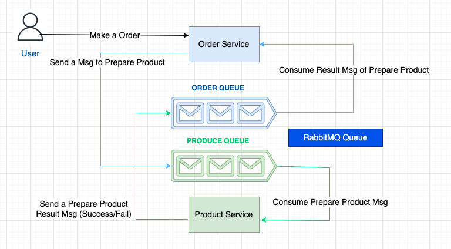

# iCommerce website that apply Clean Architect

## High level diagram
An Event Driven Architect with RabbitMQ. There are 2 microservices (Product & Order) with have own Database


## DB
1. Using MongoDB/NoSQL
2. Mongoose provides a straight-forward, schema-based solution to model your application data.


## Code structure: apply Clean Architect https://blog.cleancoder.com/uncle-bob/2012/08/13/the-clean-architecture.html

1. Send and receive message over HTTP: using Express
2. Interpreting those message: should be unique in your app
3. Formulating a response: should be unique in your app

### Break the dependency base on Clean Architect: 
- Using to factory pattern to create handle for Order & Product Endpoints
- Inject mongoose DB to Endpoints handle
- Design template for response
- Create a standart Http

### Apply TDD
- Using Jest to provide unittest

## Run Locally
This instructions is created for Mac Os

1. Setup MongoDB: using the default configs
2. Install RabbitMQ
```
brew install rabbitmq
brew services start rabbitmq
```
Login: http://localhost:15672 with _guest/guest_ account

3. Clone repo
```
git clone git@github.com:thuanhan/iCommerce.git
cd iCommerce
```
4. Run Order service
```
cd order-srv
npm install
npm start
```
5. Run Product service
```
cd product-srv
npm install
npm start
```

## Orders service Endpoint Curl

1. Create new Order
```
curl --location --request POST 'http://localhost:6161/orders' \
--header 'Content-Type: application/json' \
--data-raw '{
    "name": "Test tennis order",
    "category": "Shoes",
    "image": "/images/p3.jpg",
    "price": 120,
    "qty": 1,
    "product": "61f7aaa88aa5f21432e5313f",
    "shippingAddress": "Ho Chi Minh city"
}'
```

2. Get Order by id
```
curl --location --request GET 'http://localhost:6161/orders/{order_id}'
```

3. Filter and order Orders
Filter by name & order by price
```
curl --location --request GET 'http://localhost:6161/orders?name={filter_name}&order=lowest'
```

## Products service Endpoint Curl

1. Create new Product
```
curl --location --request POST 'http://localhost:5151/products' \
--header 'Content-Type: application/json' \
--data-raw '{
    "name": "Nike tennis",
    "category": "Shoes",
    "image": "/images/p4.jpg",
    "price": 120,
    "countInStock": 10,
    "brand": "Nike",
    "rating": 4.5,
    "numReviews": 10,
    "description": "high quality product"
}'
```

2. Get Product by id
```
curl --location --request GET 'http://localhost:5151/products/{product_id}'
```

3. Filter and order Products
Filter by name & order by price
```
curl --location --request GET 'http://localhost:5151/products?name={filter_name}&order=lowest'
```